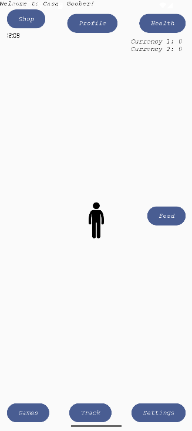
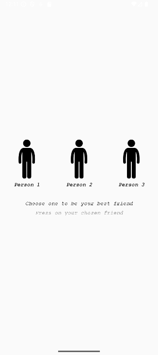
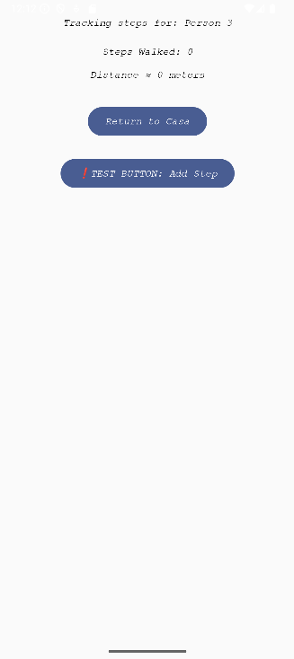

# AMI Application

**A friendly Jetpack Compose app** that simulates a companion ("Ami") — a starting scaffold for a Web3-enabled mobile friend app. Includes UI screens, step-tracking, and a scaffold for future Solana integration.

---

## Screenshots

Main screen  


Greeting screen  


Choose your friend (Stickman)  


Track (step counter)  


---

## Features

- Jetpack Compose UI with navigation.  
- Ami state model (name, hunger, sleep, boredom).  
- Step counter integration via `Sensor.TYPE_STEP_COUNTER`.  
- Solana scaffolding points ready for blockchain features.

---

## Project structure (key files)

- `app/src/main/java/com/hurendaii/ami_application/MainActivity.kt` — entry point, theming & nav setup.
- `app/src/main/java/com/hurendaii/ami_application/navigation/AppNavGraph.kt` — navigation routes and composables.
- `app/src/main/java/com/hurendaii/ami_application/ui/` — Compose screens (`MainScreen.kt`, `GreetingScreen.kt`, `StickmanScreen.kt`, `TrackScreen.kt`, etc.).
- `app/src/main/java/com/hurendaii/ami_application/ui/AmiViewModel.kt` — app state & actions.
- `app/src/main/java/com/hurendaii/ami_application/model/AmiModel.kt` — data model.
- `app/src/main/AndroidManifest.xml` — app permissions and main activity.

---

## Build & run

Requirements:
- Android Studio (Arctic Fox or newer), Java 11, Android SDK for compileSdk 36.

Steps:
```bash
git clone <repo-url>
cd ami_application
# open in Android Studio and run on emulator or device
